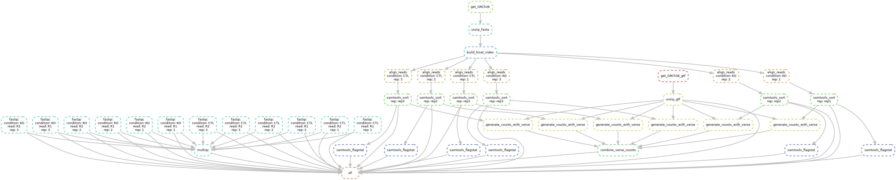

# Report

```{r setup, include=FALSE, results='hide'}
knitr::opts_chunk$set(echo = TRUE)
source('main.R')
```

## Discussion

**Remarks on the quality of sequencing reads:**

- Reads are high quality in general
  * No reads need to be removed
- Only problems are the base sequence content and sequence duplication levels
  * sequence duplication is more worrisome since it could mean enrichment bias
  * on avg %s of reads after deduplication is 25%
  * a majority >50% also are duplicated 10x or more
  * base sequence content varies most at beginning of read
- After samtools flagstats, all reads for each sample passed QC


## Methods

First, mRNAseq samples were obtained corresponding to the wild-type/control (CTL) and knockout (KO) conditions, 3 CTL and 3 KO, and 2 reads. To ensure data quality, we performed initial quality control using FastQC v0.12.1.
Next, we aligned the reads to the gencode human primary assembly genome (GRCh38, release 45) using HISAT2 v2.2.1 with paired-end alignment using default parameters.
From these alignments, we generated paired-end gene (exon) counts using VERSE v0.1.5 and the gencode 45 primary assembly GTF.
After combining the counts from all 6 samples, we filtered out genes with zero counts. Then, we performed normalization and differential expression analysis using DESeq2 v1.44.0, comparing the two conditions.
Finally, we performed a functional gene set enrichment analysis using FGSEA v1.28.0 to find functions associated with differentially expressed genes.

Snakemake Workflow Summary
```{r DAG}

```

<!--  -->

## R-side Analysis


```{r DESEQ}
#Read in verse_counts.tsv and display the head of the resulting tibble
counts_df <- load_n_trim("results/verse_counts.tsv", row.names="gene")
head(counts_df)

coldata <- data.frame(condition = rep(c("CTL", "KO"), each=3),
                      rep = rep(c("rep1", "rep2", "rep3"), times=2))
row.names(coldata) <- c("CTL_rep1", "CTL_rep2", "CTL_rep3", "KO_rep1", "KO_rep2", "KO_rep3")
cat("coldata: ")
coldata

# a warning about factors here is normal
dds <- run_deseq(counts_df, coldata, 10, "condition_CTL_vs_KO")
deseq_res <- results(dds)
cat("deseq results:")
head(deseq_res)

write.csv(deseq_res, file = "DESeq2_results.csv", quote = FALSE)
```
```{r histogram}
# get log 2 fold change from DESEQ results
log2FC <- deseq_res$log2FoldChange

hist(log2FC, main="Distribution of log2FoldChange of DE genes", ylab = "Frequency of genes")
```

<!-- pca -->
```{r pca plot}
#Create and display PCA plot
pca_plot <- plot_pca(dds, "DESeq Counts PCA")
pca_plot
```

```{r volcano plot}
# GENERATE VOLCANO PLOT
deseq_df <- as.data.frame(deseq_res)
volcano <- volcano_plot(deseq_df, "log2FoldChange", "padj", alpha=0.05)
volcano
```

```{r GSEA analysis}
deseq_res <- deseq_res %>% 
  na.omit()

ranking <- "stat"

deseq_res <- deseq_res[order(-deseq_res[[ranking]]),]
head(deseq_res)
geneList <- deseq_res[[ranking]]
names(geneList) <- str_extract(rownames(deseq_res), "^\\w*")
gse <- clusterProfiler::gseGO(
  geneList = geneList,
  ont = "BP",
  keyType = "ENSEMBL",
  OrgDb = "org.Hs.eg.db",
  eps = 1e-10
)


```

```{r}
as.data.frame(gse)
```
```{r}
# Plot the 1st most significant GS pathway
clusterProfiler::gseaplot(gse, geneSetID = 1)
```
```{r}
top10_genes <- deseq_df[base::order(deseq_df[['padj']]), ][1:10, ] %>% rownames() %>% str_extract("^\\w+")
cat(top10_genes, sep = ', ')
```

```{r DAVID enrichment analsys}

clusterProfiler::enrichDAVID(gene = top10_genes,
                             idType="ENSEMBL_GENE_ID")
```

